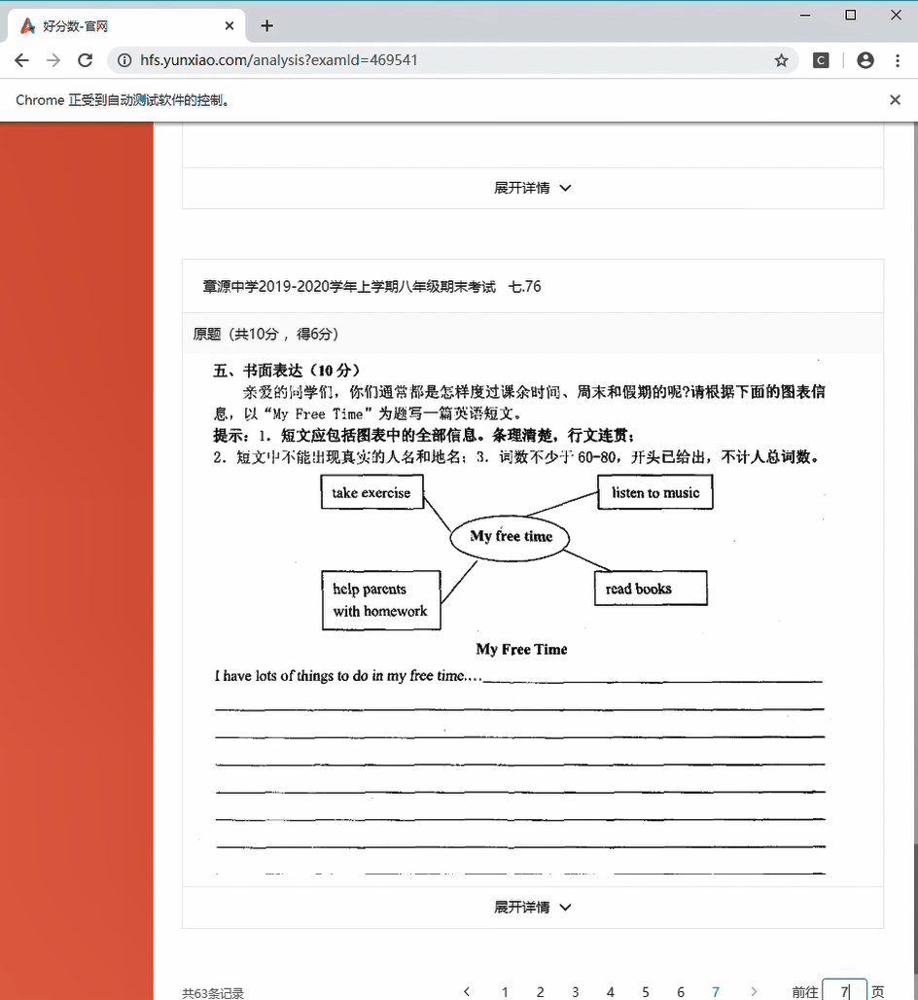

**爬虫记录** 

**网站 ：**

[好分数]: https://hfs.yunxiao.com/	"好分数官网"

**目的：**

爬取老弟期末试卷片段，组成一张完整的试卷。在好分数上只有试卷题目的一小块一小块图片，而我想要完整的试卷给他写（我觉得这个老哥可以），在被好分数在线客服告知后台也没有完整试卷之后，我开始干了

**思路:**

​	我先登录了他的好分数账号,然后探索到试切片页面的url,想着直接把所有的url写到一个文件里,再直接下载下来.后来发现试卷图片都是js实施渲染加载出来的,无法直接通过页面来获取图片.查了资料后了解到 http://www.selenium.org.cn/

[selenium]: http://www.selenium.org.cn/	"selenium官网"

这个库,可以获取到js动态渲染的元素.然后就照着这篇

[博客]: https://www.cnblogs.com/3sss-ss-s/p/10313758.html

敲了一遍,基本原理了解后,开始了我的爬虫之旅.

**文件说明:**

- image [拍下来的试卷片段的url,以及下载下来的图片]
- test_doc [送给老弟的假期礼物🎁]
- d_haofenshu.py [selenium爬取好分数主要代码,账号密码已经删去,无法复现] 
- download_image.py [按照爬下来的试卷片段url下载图片]

ps:

发现一个好用的gif制作软件

[ScreenToGif]: https://github.com/NickeManarin/ScreenToGif
